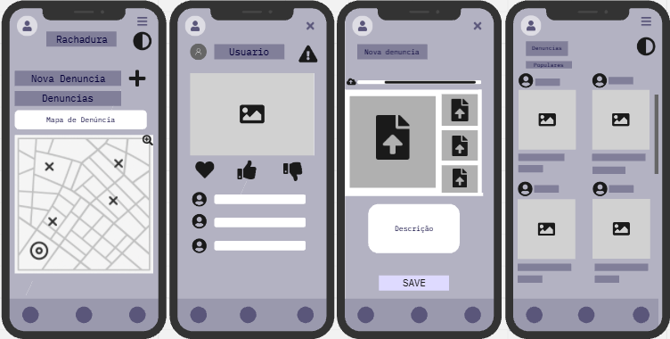

# Introdução

## Informações básicas do projeto.

* **Projeto:** Radar Urbano
* **Repositório GitHub:** Rachadura
* **Membros da equipe:**
  * [Vinícius dos Santos Gonçalves](https://github.com/MomoSkywalker) 
  * [Lucas do Carmo Braz](https://github.com/llucasBraz) 
  * [Pedro Augusto Carvalho de Oliveira](https://github.com/Pedro-C4RVALHO)
  * [Arthur Souza Fernandes](https://github.com/arthurxds)
  * [Gabriel Costa Silva](https://github.com/GabrielCosta1311)
  * [Victor Roberto Chagas Alves](https://github.com/vitinho17alves)
  * [Stêvão Guadanini Diniz](https://github.com/Stevao-xd)
  * [Lucas Maia Marques Pinheiro](https://github.com/lvcasxm)

A documentação do projeto é estruturada da seguinte forma:

1. Introdução
2. Contexto
3. Product Discovery
4. Product Design
5. Metodologia
6. Solução
7. Referências Bibliográficas

✅ [Documentação de Design Thinking (MIRO)](files/processo-dt.pdf)

# Contexto

A Região Metropolitana de Belo Horizonte, bem como muitas outras áreas urbanas do Brasil, sofre muito com problemas de infraestrutura urbana, graças ao crescimento desordenado e ao descaso do poder público, que não dá a devida atenção e não se prontifica a solucionar esses problemas que tanto aflingem a população. É comum vermos buracos nas calçadas e nas estradas, praças mal cuidadas, iluminação precária nas ruas, falta de eletricidade, problemas no transporte público e assim por diante, e, infelizmente, nos acostumamos a relevar tais problemas, de forma que não denunciamos, e, mesmo se eventualmente quisermos, nem ao menos sabemos como fazer isso de forma prática.

Sendo assim, o projeto propõe a criação de um software simples e intuitivo que permita os moradores dessas regiões fazerem denúncias de infraestrutura, de modo que seja fácil o anexo de fotos, vídeos, comentários, e de forma que essas denúncias efetivamente cheguem às autoridades competentes.

## Problema

Nosso grupo identificou que não havia um mecanismo fácil e acessível de comunicar problemas de infraestrutura urbana diretamente às autoridades competentes, o que dificulta a vida dos cidadãos que enfrentam tais problemas, uma vez que muitas vezes eles nem sequer sabem como fazer isso. Sendo assim, reduzimos nosso escopo para os moradores da zona Metropolitana da Grande Belo Horizonte, e focamos nos problemas relacionados às vias públicas e da infraestrutura urbana, o que inclui todo o ecossistema urbano que vemos e usamos diariamente, como calçadas, parques, praças, ônibus e assim por diante. Mas, além disso, também é possível denunciar problemas na rede elétrica, na captação fluvial e outros.

A decisão de focar na Região Metropolitana surgiu da constatação de que muitas dessas cidades foram sendo construídas de maneira desordenada, sem que houvesse um planejamento urbano que acompanhasse seu crescimento populacional, o que gera uma gama de problemas que, ao longo do tempo, se acumulam e se tornam cada vez mais difíceis de serem resolvidos, principalmente porque o poder público nada ou pouco faz para resolvê-los. Existem muito poucos projetos de revitalização em andamento, sem contar a falta de loteamento, arborização, asfaltamento e assim por diante. 

Portanto, buscamos criar um canal que dê ao cidadão um maior sentimento de integração com a cidade e com as demais pessoas, e que também o permita exercer sua vox populi, porque, ao reconhecer a existência de um problema, e denunciá-lo, não é somente a pessoa que se beneficia, porque muitas outras também utilizam do mesmo espaço, e com certeza sofrem pelos mesmos motivos.

## Objetivos

### Objetivos Gerais

O objetivo geral deste projeto é desenvolver um software que permita os moradores da Região Metropolitana denunciar problemas de infraestrutura urbana, como falhas em vias públicas, calçadas, praças, transporte coletivo, entre outros. O software deverá ser acessível, de modo que facilite o processo de denúncia e seja intuitivo na identificação do fluxo que o usuário deve percorrer, para anexar fotos e/ou vídeos, incluir uma descrição do problema e identificar sua localização e assim por diante. Com isso, busca-se promover uma maior integração entre cidadão e cidade, incentivando a participação popular nas decisões públicas e contribuindo para a melhoria do bem-estar coletivo no uso dos espaços urbanos.

### Objetivos Específicos

- **1) Mapear todos as denúncias feitas num determinado local.**  
Fazer com que o usuário acesse o histórico de denúncias feitas naquela região, para que seja possível identificar quais são as áreas ou quais são os problemas mais recorrentes de lá.

- **2) Criar uma interface de usuário fácil e intuitiva.**  
Tornar fácil a utilização do software, para que o cidadão não enfrente dificuldades em reconhecer um problema e rapidamente denunciá-lo, de modo que a interface seja bem clara e objetiva.

- **3) implementar um algortimo de tags que separa as denúncias.**  
Na hora de enviar o problema, o usuário deve adicionar uma tag ou alguma forma de identificação referente ao que ele está denunciando, para que facilite na organização e vizualização do histórico daquela região.

- **4) Enganjamento entre os usuários.**  
Criar uma forma de dar "like" ou "dislike" nas denúncias, bem como criar também uma seção de comentários, evitando com que denúncias repetidas sejam feitas referentes ao mesmo problema, e identificando àquelas que precisam de mais urgência para serem resolvidas.

- **5) Integração do software com APIs de localização.**  
Permitir o reconhecimento e a vizualicação das dénuncias em tempo real.

## Justificativa

A deterioração da infraestrutura urbana nas cidades brasileiras não é um problema novo, mas sua persistência revela uma falha crônica no diálogo entre população e poder público. Moradores convivem diariamente com:

- Calçadas esburacadas
- Bueiros entupidos
- Praças abandonadas
- Iluminação pública deficiente

Problemas que, embora pareçam pequenos isoladamente, somados comprometem significativamente a qualidade de vida urbana.

### O cerne da questão

Está na ausência de canais eficazes que:

1. Documentem sistematicamente esses problemas cotidianos
2. Dêem visibilidade às demandas recorrentes da população
3. Criem um histórico público que evidencie padrões de negligência

### Situação atual

Quando um cidadão tenta reportar um buraco na rua ou a falta de iluminação:

- As reclamações se perdem em canais burocráticos e fragmentados
- Não há transparência sobre o andamento das solicitações
- Falta um registro organizado que mostre problemas crônicos em determinadas áreas

### Fundamentação do projeto

Nosso projeto nasce da constatação de que:

> "Problemas documentados têm 3x mais chances de solução" (IPEA, 2023)

Dados relevantes:

- Comunidades organizadas conseguem melhores respostas do poder público (FGV, 2022)
- A falta de um histórico dificulta a cobrança por melhorias (PBH, 2023)

#### Diferencial

Não se trata apenas de criar mais um aplicativo, mas de estabelecer:

- Uma memória coletiva dos problemas urbanos
- Uma ferramenta que transforme o descontentamento esporádico em:
  - Dados organizados
  - Ações coordenadas

**Exemplo:** Quando uma comunidade pode mostrar, com registros acumulados ao longo de meses, que determinado cruzamento segue perigoso por falta de iluminação, sua voz ganha peso político considerável.

### Impacto Esperado

Ao organizar a demanda social, buscamos:
- Reduzir a assimetria de informação entre população e governo
- Criar accountability para a gestão urbana
- Empoderar os cidadãos como agentes ativos da mudança

> ### Referências
> 
> - "Participação Social e Gestão Urbana" (IPEA, 2023)
> - "Eficácia de Ferramentas Cívicas" (FGV, 2022)
> - "Relatório de Demandas Urbanas" (PBH, 2023)

## Público-Alvo

O público-alvo do nosso software é todos os moradores da Região Metropolitana de Belo Horizonte, que enfrentam ou que já enfrentaram problemas de infraestrutura, e que desconhecem meios de denunciar tais problemas. Pelo fato do tópico ser bem abrangente, e sabendo que praticamente todas as pessoas já enfrentaram problemas como esses, podemos abranger tanto alguém que utiliza o transporte público, quanto alguém que costuma frequentar parques e pracinhas, quanto alguém que trabalha como Uber, quanto alguém que mora em uma região com problemas de eletricidade e assim por diante. No quesito acessibilidade, o foco são pessoas que possuam um celular com acesso à internet, mas que não necessariamente possuam muito conhecimento tecnológico, porque buscamos tornar a interface de usuário simples e dinâmica, para que seja fácil e rápido fazer uma denúncia.

# Product Discovery

## Etapa de Entendimento

**✳️✳️✳️ APRESENTE OS ARTEFATOS DA ETAPA  ✳️✳️✳️**

### **Matriz de Alinhamento CSD & Mapa de Stakeholders:**


### **Entrevistas Qualitativas & Highlights de Pesquisa:**
* 1ª Entrevista:

 
 

* 2ª Entrevista:

 
 

* 3ª Entrevista:

 
 

* 4ª Entrevista:

 
 

* 5ª Entrevista:

 
 

* 6ª Entrevista:

 

## Etapa de Definição

### Personas

**✳️✳️✳️ APRESENTE OS DIAGRAMAS DE PERSONAS ✳️✳️✳️**

* **David Hatsunaga:**


* **Ana Costa:**


* **Pedro Silva:**


* **Lucas Almeida:**


# Product Design

Nesse momento, vamos transformar os insights e validações obtidos em soluções tangíveis e utilizáveis. Essa fase envolve a definição de uma proposta de valor, detalhando a prioridade de cada ideia e a consequente criação de wireframes, mockups e protótipos de alta fidelidade, que detalham a interface e a experiência do usuário.

## Histórias de Usuários

Com base na análise das personas foram identificadas as seguintes histórias de usuários:

| **Eu como...**                     | **Preciso de..**                                          | **Para**                                                 |
|---------------------------------|----------------------------------------------------------|-------------------------------------------------------------|
| Motorista de Uber               | Site que indique problemas na estrada ou via pública      | Ter rota mais segura e rápida                               |
| Cidadão preocupado com segurança| Reportar postes de luz apagados ou com defeito           | Garantir ruas bem iluminadas à noite                        |
| Trabalhador que usa carro       | Informações sobre vias interditadas                      | Evitar atrasos no trabalho                                  |
| Entregador de delivery          | Site com informações de vias seguras e rápidas           | Ter rotas seguras durante entregas                          |
| Motorista de ambulância         | Dados sobre vias interditadas, alagadas ou desmoronamento| Deslocamento rápido e seguro com ou sem paciente            |
| Ciclista                       | Informações sobre ciclovias e segurança nas mesmas       | Prevenir acidentes e garantir segurança                     |
| Caminhoneiro                   | Mais áreas de escape no anel rodoviário                  | Melhorar segurança no trânsito                              |
| Pedestre                       | Calçadas seguras e presentes em todas as vias            | Garantir segurança ao caminhar 

## Proposta de Valor

##### Proposta para Persona 1 (Engenheiro Mecânico)


##### Proposta para Persona 2 (Motorista de Uber em tempo integral)


##### Proposta para Persona 3(Designer gráfico freelancer e ciclista ativo)


##### Proposta para Persona 3(Estudante universitário e cidadão ativo)


## Requisitos

As tabelas que se seguem apresentam os requisitos funcionais e não funcionais que detalham o escopo do projeto.

### Requisitos Funcionais

| ID     | Descrição do Requisito                                   | Prioridade |
| ------ | ---------------------------------------------------------- | ---------- |
| RF-001 | O sistema deve permitir que o usuário avalie e comente uma denúncia  | Alta       |
| RF-002 | O sistema deve permitir interação do usuário com o Mapa | Alta     |
| RF-003 | O sistema deve permitir que a denúncia seja compartilhada via link | Média     |
| RF-004 | O sistema deve permitir que a denúncia seja categorizada | Média     |
| RF-005 | O sistema deve permitir que uma dica pertinente de como agir em uma situação de perigo seja mostrada de acordo com a categoria do problema | Média     |
| RF-006 | O sistema deve permitir que o usuário faça upload de fotos e vídeos do problema que está denunciando | Alta     |
| RF-007 | O sistema deve permitir que o usuário faça uma descrição daquilo que está denunciando | Alta     |
| RF-008 | O sistema deve ter uma página de Login, uma de Registro e uma de Cadastro | Baixo     |

### Requisitos não Funcionais

| ID      | Descrição do Requisito                                                              | Prioridade |
| ------- | ------------------------------------------------------------------------------------- | ---------- |
| RNF-001 | O sistema deve ter modo Claro e Escuro (que também se extende ao mapa) | Média     |
| RNF-002 | O sistema deve ter design responsivo para garantir boa usabilidade em diferentes dispositivos (PC, tablet, celular)          | Alta      |
| RNF-003 | O sistema deve ter uma notificação de status da denúncia (se o problema ainda está em aberto ou se foi concluído)          | Baixa      |
| RNF-004 | O sistema deve ter escalabilidade de quantidade de usuário          | Baixa      |
| RNF-005 | O sistema deve ter fonte adequada, esteticamente agradável, de fácil leitura e com padronização de cor.          | Média      |
| RNF-006 | O sistema deve ter interface intuitiva e acessível, mesmo para usuários com pouca experiência digital.          | Alta      |
| RNF-007 | O sistema deve ter formulários fáceis de preencher, minimizando campos obrigatórios.          | Baixa      |
| RNF-008 | O sistema deve ter feedback visual e mensagens claras após cada ação do usuário (ex.: denúncia enviada com sucesso).          | Alta      |
| RNF-009 | O sistema deve funcionar durante o dia inteiro          | Alta      |
| RNF-010 | O sistema deve ser feito por meio das linguagens de HTML, CSS e JavaScript          | Alta      |
| RNF-011 |O sistema deve ser publicado em ambiente acessível via internet  | Alta      |

## Projeto de Interface

Artefatos relacionados com a interface e a interacão do usuário na proposta de solução.

### Wireframes

Estes são os protótipos de telas do sistema.

##### Telas para Dispositivos Moveis . 

Estas imagens representam esboços iniciais da nossa proposta de interface.
Elas foram desenvolvidas com o objetivo de ilustrar visualmente as funcionalidades e o fluxo de navegação do sistema, servindo como base para futuras etapas de design e desenvolvimento. 




### User Flow


# Metodologia
Organização
O grupo se reunia aos finais de semana, visto que muitos trabalhavam em tempo integral durante a semana, via Discord para uma chamada de voz onde eram estipuladas, em conjunto e de acordo com a agenda de cada integrante, as tarefas que cada um executaria, estipulando um prazo para que tudo fosse entregue e integrado de maneira organizada.

Durante as fases iniciais do projeto, o Miro foi utilizado como a principal ferramenta para a execução das tarefas estipuladas pelos professores durante a semana.

Nas fases posteriores, houve um maior esforço para que, em complemento ao servidor criado no Discord (onde eram armazenadas as principais informações - como link do Miro, das atividades do Canvas e do repositório criado no GitHub), também fosse feito uso da aba "Projects" na própria plataforma do GitHub, onde poderíamos estipular com mais critério e de forma mais clara a quem cada atividade caberia - além de tornar mais fácil a interação entre os integrantes para mostrar quais atividades foram concluídas ou ainda estavam em execução.

Para a realização dos wireframes, fizemos uso do próprio Miro, que fornece alguns templates que facilitam o processo de criação de croquis das principais páginas do site e o fluxo pelo qual o usuário teria que passar para realizar qualquer tarefa presente na aplicação.

Focamos em manter o layout do site em "Mobile-First" (Dispositivos Móveis em Primeiro Lugar), visto que o objetivo do projeto é torná-lo o mais simples possível para uso diário, tanto para pessoas que sejam novas na plataforma e queiram ter uma experiência mais "User Friendly" (Amigável ao Usuário), quanto para pessoas que têm dificuldades com o manuseio de aparelhos telefônicos e aplicações mais modernas - que são geralmente as pessoas que mais enfrentam problemas de infraestrutura, mas que possuem pouquíssimas plataformas ou incentivos para denunciar aquilo que as aflige.

## Ferramentas

Relação de ferramentas empregadas pelo grupo durante o projeto.

| Ambiente                    | Plataforma | Link de acesso                                     |
| --------------------------- | ---------- | -------------------------------------------------- |
| Processo de Design Thinking | Miro       | https://miro.com/app/board/uXjVIaSTdWs=/?share_link_id=242424685997        |
| Repositório de código       | GitHub     | https://github.com/ICEI-PUC-Minas-PMGES-TI/pmg-es-2025-1-ti1-2401100-rachadura.git      |
| Wire Frame                  | Miro       | https://miro.com/app/board/uXjVIG0RF0w=/ |
| Protótipo Interativo        | Figma  |  https://www.figma.com  |
| Apresentação de Slides      | Canvas     | https://shorturl.at/qYviM |
| Lista de Requisitos &  História de Usuários | MarkDown Table Editor | https://www.tablesgenerator.com/markdown_tables |
| README.md Edição de Texto | StackEdit | https://stackedit.io/ |

## Gerenciamento do Projeto

Divisão de papéis no grupo e apresentação da estrutura da ferramenta de controle de tarefas (Kanban).


>
> Para a execução do projeto Rachadura de T.I., seguimos uma abordagem baseada em metodologias ágeis, especialmente o Scrum e o processo de Design Thinking. As etapas foram estruturadas visando a colaboração eficiente entre os membros do grupo, a divisão clara de tarefas e o uso de ferramentas modernas para organização, versionamento e acompanhamento do desenvolvimento.

# Solução Implementada

Esta seção apresenta todos os detalhes da solução criada no projeto.

## Vídeo do Projeto

O vídeo a seguir traz uma apresentação do problema que a equipe está tratando e a proposta de solução. ⚠️ EXEMPLO ⚠️

[](https://www.youtube.com/embed/70gGoFyGeqQ)

> ⚠️ **APAGUE ESSA PARTE ANTES DE ENTREGAR SEU TRABALHO**
>
> O video de apresentação é voltado para que o público externo possa conhecer a solução. O formato é livre, sendo importante que seja apresentado o problema e a solução numa linguagem descomplicada e direta.
>
> Inclua um link para o vídeo do projeto.

## Funcionalidades

Esta seção apresenta as funcionalidades da solução.Info

##### Funcionalidade 1 - Cadastro de Contatos ⚠️ EXEMPLO ⚠️

Permite a inclusão, leitura, alteração e exclusão de contatos para o sistema

* **Estrutura de dados:** [Contatos](#ti_ed_contatos)
* **Instruções de acesso:**
  * Abra o site e efetue o login
  * Acesse o menu principal e escolha a opção Cadastros
  * Em seguida, escolha a opção Contatos
* **Tela da funcionalidade**:


> ⚠️ **APAGUE ESSA PARTE ANTES DE ENTREGAR SEU TRABALHO**
>
> Apresente cada uma das funcionalidades que a aplicação fornece tanto para os usuários quanto aos administradores da solução.
>
> Inclua, para cada funcionalidade, itens como: (1) titulos e descrição da funcionalidade; (2) Estrutura de dados associada; (3) o detalhe sobre as instruções de acesso e uso.

## Estruturas de Dados

Descrição das estruturas de dados utilizadas na solução com exemplos no formato JSON.Info

##### Estrutura de Dados - Contatos   ⚠️ EXEMPLO ⚠️

Contatos da aplicação

```json
  {
    "id": 1,
    "nome": "Leanne Graham",
    "cidade": "Belo Horizonte",
    "categoria": "amigos",
    "email": "Sincere@april.biz",
    "telefone": "1-770-736-8031",
    "website": "hildegard.org"
  }
  
```

##### Estrutura de Dados - Usuários  ⚠️ EXEMPLO ⚠️

Registro dos usuários do sistema utilizados para login e para o perfil do sistema

```json
  {
    id: "eed55b91-45be-4f2c-81bc-7686135503f9",
    email: "admin@abc.com",
    id: "eed55b91-45be-4f2c-81bc-7686135503f9",
    login: "admin",
    nome: "Administrador do Sistema",
    senha: "123"
  }
```

> ⚠️ **APAGUE ESSA PARTE ANTES DE ENTREGAR SEU TRABALHO**
>
> Apresente as estruturas de dados utilizadas na solução tanto para dados utilizados na essência da aplicação quanto outras estruturas que foram criadas para algum tipo de configuração
>
> Nomeie a estrutura, coloque uma descrição sucinta e apresente um exemplo em formato JSON.
>
> **Orientações:**
>
> * [JSON Introduction](https://www.w3schools.com/js/js_json_intro.asp)
> * [Trabalhando com JSON - Aprendendo desenvolvimento web | MDN](https://developer.mozilla.org/pt-BR/docs/Learn/JavaScript/Objects/JSON)

## Módulos e APIs

Esta seção apresenta os módulos e APIs utilizados na solução

**Fonts:**

* Google Fonts - [https://fonts.google.com/](https://fonts.google.com/) 

**Scripts:**

* jQuery - [http://www.jquery.com/](http://www.jquery.com/) ⚠️ EXEMPLO ⚠️
* Bootstrap 4 - [http://getbootstrap.com/](http://getbootstrap.com/) ⚠️ EXEMPLO ⚠️

> ⚠️ **APAGUE ESSA PARTE ANTES DE ENTREGAR SEU TRABALHO**
>
> Apresente os módulos e APIs utilizados no desenvolvimento da solução. Inclua itens como: (1) Frameworks, bibliotecas, módulos, etc. utilizados no desenvolvimento da solução; (2) APIs utilizadas para acesso a dados, serviços, etc.

# Referências

As referências utilizadas no trabalho foram:

Referências Bibliográficas (ABNT)
Documentação da API Google Maps:
GOOGLE. Google Maps Platform. 2023. Disponível em: https://developers.google.com/maps. Acesso em: 11/04/2025.

Desenvolvimento de Sistemas Web:
FLANAGAN, David. JavaScript: O Guia Definitivo. 7. ed. Porto Alegre: Bookman, 2020. 1080 p.

Integração de APIs REST:
RICHARDSON, Leonard; RUBY, Sam. RESTful Web APIs. 1. ed. Sebastopol: O’Reilly Media, 2013. 408 p.

Design de UX para Sistemas de Chamados:
NIELSEN, Jakob. Usabilidade na Web. 1. ed. Rio de Janeiro: Campus, 2000. 420 p.

Boas Práticas em Infraestrutura de TI:
TANENBAUM, Andrew S.; VAN STEEN, Maarten. Distributed Systems: Principles and Paradigms. 3. ed. Boston: Pearson, 2017. 800 p.


